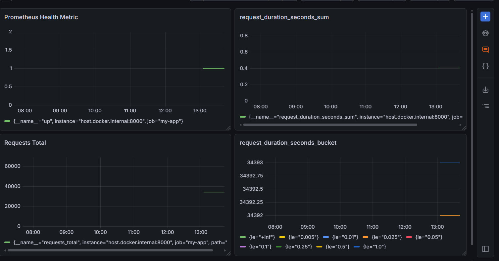

# Stress Monitoring using Prometheus and Grafana

A real-time stress testing and monitoring pipeline using **FastAPI**, **Prometheus**, **k6**, and **Grafana**.


## Overview

This project provides a complete load testing setup that:

- Exposes a FastAPI application with Prometheus metrics
- Generates configurable load using k6
- Scrapes and stores metrics with Prometheus
- Visualizes results in real-time with Grafana dashboards

## Architecture

```
┌─────────────┐    ┌─────────────┐    ┌─────────────┐
│     k6      │───▶│   FastAPI   │───▶│ Prometheus  │───▶  Grafana
│ (Load Test) │    │   (App)     │    │ (Scrape)    │       (Dashboard)
└─────────────┘    └─────────────┘    └─────────────┘
```

## Project Structure

```
stress-monitoring-lab/
├── app/
│   ├── main.py              # FastAPI application with metrics
│   └── requirements.txt     # Python dependencies
├── grafana-storage/          # Grafana persistent storage (created on first run)
├── prometheus.yml           # Prometheus scrape configuration
└── load-test.js            # Duplicate k6 test (root level)
```

## Components

### 1. FastAPI Application (`app/main.py`)

A simple web app instrumented with Prometheus metrics:

- **`GET /`** — Returns `{"message": "Hello! I'm running."}` with request tracking
- **`GET /metrics`** — Exposes Prometheus-format metrics

**Metrics exported:**
| Metric | Type | Description |
|--------|------|-------------|
| `requests_total` | Counter | Total number of requests by path |
| `request_duration_seconds` | Histogram | Request duration in seconds |

### 2. k6 Load Test (`load-test.js`)

Configurable load test that ramps up virtual users:

- **10s** ramp-up to 10 users
- **20s** sustained load at 10 users
- **10s** ramp-down to 0 users

### 3. Prometheus (`prometheus.yml`)

Scrape configuration that collects metrics from the app every 3 seconds.

### 4. Grafana Dashboard

Real-time visualization dashboard with 4 panels:

**Dashboard Panels:**

| Panel Name | Metric | Type | Description |
|------------|--------|------|-------------|
| Prometheus Health | `up{job="my-app"}` | Stat | Checks if Prometheus can reach the app |
| Request Duration (Bucket) | `request_duration_seconds_bucket` | Time Series | Histogram buckets for latency distribution |
| Requests Total | `requests_total` | Time Series | Total request count by path |
| Request Duration (Sum) | `request_duration_seconds_sum` | Time Series | Sum of request durations |


**Dashboard Panels:**

| Panel | Query |
|-------|-------|
| Prometheus Health | `up{job="my-app"}` |
| Request Duration Bucket | `request_duration_seconds_bucket` |
| Requests Total | `requests_total` |
| Request Duration Sum | `request_duration_seconds_sum` |

**Sample Dashboard Preview:**




### Prerequisites

- Python 3.11+
- Docker Desktop
- k6 (optional, can run via Docker)

### 1. Install Python dependencies

```bash
cd app
pip install -r requirements.txt
```

### 2. Start the FastAPI application

```bash
cd app
uvicorn app.main:app --reload
```

The app runs at `http://localhost:8000`

### 3. Start Prometheus

```bash
prometheus --config.file=prometheus.yml
```

Prometheus UI: `http://localhost:9090`

### 4. Start Grafana

```bash
docker run -d --name=grafana -p 3000:3000 -v "F:\stress-monitoring-lab\grafana-storage:/var/lib/grafana" grafana/grafana
```

Grafana UI: `http://localhost:3000`
- Default credentials: `admin` / `admin`

### 5. Add Prometheus to Grafana

1. Navigate to **Configuration** → **Data Sources**
2. Click **Add data source** → **Prometheus**
3. Set URL to `http://host.docker.internal:9090` (Docker) or `http://localhost:9090` (local)
4. Click **Save & Test**

### 6. Run the load test

```bash
docker run --rm -v "F:\stress-monitoring-lab:/scripts" grafana/k6 run /scripts/k6/load-test.js
```

## Dashboard Queries

Dashboard queries for Grafana panels:

| Panel Name | Metric | Query |
|------------|--------|-------|
| Prometheus Health | `up{job="my-app"}` | Checks app availability |
| Request Duration (Bucket) | `request_duration_seconds_bucket` | Latency histogram buckets |
| Requests Total | `requests_total` | Total request count |
| Request Duration (Sum) | `request_duration_seconds_sum` | Request duration total |

**Additional useful queries:**

| Metric | Query |
|--------|-------|
| Request Rate (req/s) | `rate(requests_total[1m])` |
| Avg Response Time | `rate(request_duration_seconds_sum[1m]) / rate(request_duration_seconds_count[1m])` |
| P95 Latency | `histogram_quantile(0.95, rate(request_duration_seconds_bucket[1m]))` |
| P99 Latency | `histogram_quantile(0.99, rate(request_duration_seconds_bucket[1m]))` |

## Configuring the Load Test

Edit `load-test.js` to customize load patterns:

```javascript
export const options = {
  stages: [
    { duration: '10s', target: 10 },   // Ramp up to 10 users
    { duration: '20s', target: 10 },   // Stay at 10 users
    { duration: '10s', target: 0 },    // Ramp down
  ],
};
```

## API Endpoints

| Endpoint | Method | Description |
|----------|--------|-------------|
| `/` | GET | Health check & test endpoint |
| `/metrics` | GET | Prometheus metrics output |

## Cleaning Up

```bash
# Stop containers
docker stop grafana prometheus
docker rm grafana prometheus

# Stop Python server
# Press Ctrl+C in the terminal running uvicorn
```

## Extending the Project

### Add more metrics

Edit `app/main.py` to add custom metrics:

```python
from prometheus_client import Gauge

active_users = Gauge("active_users", "Number of active users")
```

### Add more endpoints

```python
@app.get("/api/v1/resource")
def resource():
    # Your code here
    active_users.inc()
    return {"status": "ok"}
```

### Customize Prometheus scrape interval

Edit `prometheus.yml`:

```yaml
global:
  scrape_interval: 5s  
```

## License

MIT License
