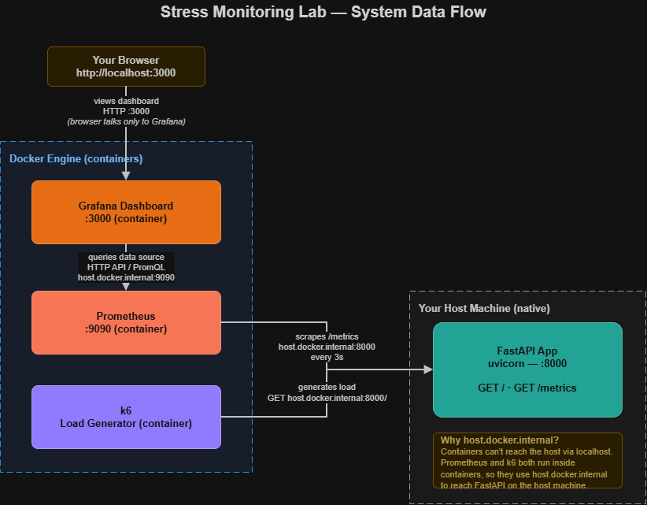

# Stress Monitoring Lab — FastAPI, Prometheus, k6 & Grafana

A hands-on lab that walks you through building a real-time load-testing and
monitoring pipeline **from an empty folder**. By the end you will have a
FastAPI service (running on your host machine) exposing Prometheus metrics,
a containerized Prometheus scraping those metrics, a containerized k6 script
generating load, and a containerized Grafana dashboard showing it all move
in real time.

Follow this top to bottom. Each chapter has the same shape:

> **Why this chapter → the code → what the code does → verify it works**

Don't skip the verify step — every later chapter depends on the earlier ones
actually working.

---

## What you'll build

```
  k6 (Docker container)
        │  GET http://host.docker.internal:8000/
        ▼
  FastAPI app  ──exposes──►  /metrics
  (native, :8000)                │
                                  │ scraped every 3s
                                  ▼
                       Prometheus (Docker container, :9090)
                                  │
                                  │ queried by
                                  ▼
                       Grafana (Docker container, :3000)
```

- **FastAPI** runs natively on your machine and exposes `/metrics`.
- **Prometheus** runs in Docker and scrapes that endpoint via
  `host.docker.internal` (Docker's DNS name for "the machine hosting this
  container").
- **k6** also runs in Docker, hitting the app the same way, to generate load.
- **Grafana** runs in Docker and queries Prometheus to draw the dashboard.

## What you'll learn

- How to instrument a FastAPI app with Prometheus client metrics (`Counter`,
  `Histogram`)
- Why `host.docker.internal` matters when containers need to reach a
  host-run service
- How Prometheus scrape configs and targets work
- How to write and run a k6 load test
- How to wire Prometheus into Grafana and read latency histograms (buckets,
  sum, p95/p99)

---

## System architecture



---

## Prerequisites

| Tool | Version | Purpose | Check |
|------|---------|---------|-------|
| Python | 3.11+ | Runs the FastAPI app | `python --version` |
| Docker Desktop | latest | Runs Prometheus, k6, Grafana | `docker --version` |

k6 and Prometheus don't need to be installed natively — this lab runs both
via Docker so their `host.docker.internal` targets resolve correctly. (If you
run them natively instead, you'll need to change every `host.docker.internal`
in the config files below to `localhost`.)

---

## Final project structure

Create the top folder now — this is what you'll have by the end:

```
stress-monitoring-lab/
├── app/
│   ├── main.py            # FastAPI app + Prometheus metrics (Chapter 1)
│   └── requirements.txt   # Python dependencies (Chapter 1)
├── grafana-storage/       # Grafana data — auto-created on first run (Chapter 4)
├── prometheus.yml         # Prometheus scrape config (Chapter 2)
├── load-test.js           # k6 load test (Chapter 3)
└── README.md
```

```bash
mkdir -p stress-monitoring-lab/app
cd stress-monitoring-lab
```

---

## Chapter 1 — Serve the app and expose metrics

**Why this chapter.** Before Prometheus can scrape anything, we need a running
service that both answers requests and reports numbers about itself. This
chapter builds the FastAPI app with two endpoints: `/` (the actual service)
and `/metrics` (what Prometheus will scrape in Chapter 2).

### The code

`app/requirements.txt`:

```
fastapi
uvicorn
prometheus-client
```

`app/main.py`:

```python
import time
from fastapi import FastAPI
from prometheus_client import Counter, Histogram, generate_latest
from fastapi.responses import PlainTextResponse

app = FastAPI()

requests_total = Counter("requests_total", "Total requests", ["path"])

request_duration = Histogram(
    "request_duration_seconds",
    "Request duration",
    ["path"],
    buckets=[0.005, 0.01, 0.025, 0.05, 0.1, 0.25, 0.5, 1],
)


@app.get("/")
def home():
    start_time = time.time()
    requests_total.labels(path="/").inc()
    response = {"message": "Hello! I'm running."}
    duration = time.time() - start_time
    request_duration.labels(path="/").observe(duration)
    return response


@app.get("/metrics", response_class=PlainTextResponse)
def metrics():
    return generate_latest()
```

Install and run:

```bash
cd app
pip install -r requirements.txt
uvicorn main:app --reload
```

The app runs at `http://localhost:8000`.

### What the code does

- **`requests_total`** — a `Counter` labelled by `path`. Every call to `home()`
  increments `requests_total{path="/"}` by 1.
- **`request_duration`** — a `Histogram` with **explicit buckets**
  (`0.005s` up to `1s`). Prometheus sorts each observed duration into the
  smallest bucket it fits, plus an implicit `+Inf` bucket for anything over 1s.
  This also auto-generates `request_duration_seconds_sum` (total time) and
  `request_duration_seconds_count` (number of observations).
- **Where timing happens**: `start_time` / `duration` are measured **only
  around building the response dict** inside `home()` — not the full
  request/response cycle (routing, serialization, network). So this metric
  reflects handler-internal work, not true end-to-end latency. Worth knowing
  when you read the numbers later.
- **`/metrics`** is deliberately *not* instrumented — it doesn't increment
  `requests_total` or `request_duration` for itself, so Prometheus scraping it
  doesn't pollute the app's own traffic numbers.
- **`generate_latest()`** renders all registered metrics in Prometheus's text
  exposition format; `PlainTextResponse` serves it as plain text, which
  Prometheus can parse.

### Verify it works

```bash
curl http://localhost:8000
curl http://localhost:8000/metrics
```

Expected from the first call:

```json
{"message": "Hello! I'm running."}
```

Expected in `/metrics` (abbreviated):

```
# HELP requests_total Total requests
# TYPE requests_total counter
requests_total{path="/"} 1.0
# HELP request_duration_seconds Request duration
# TYPE request_duration_seconds histogram
request_duration_seconds_bucket{le="0.005",path="/"} 1.0
...
request_duration_seconds_sum{path="/"} 0.000012...
request_duration_seconds_count{path="/"} 1.0
```


✅ **Checkpoint:** `curl /` returns the hello message, and `curl /metrics`
shows `requests_total` and `request_duration_seconds_*`, and the counter
climbs each time you re-curl `/`.

---

## Chapter 2 — Scrape metrics with Prometheus

**Why this chapter.** `/metrics` is a live snapshot that forgets the past.
Prometheus scrapes it on a schedule and stores the values as queryable time
series. Because Prometheus will run in a container while your app runs
natively, it needs `host.docker.internal` to reach it.

### The code

`prometheus.yml` (repo root):

```yaml
global:
  scrape_interval: 3s   # How often Prometheus checks the app

scrape_configs:
  - job_name: 'my-app'
    static_configs:
      - targets: ['host.docker.internal:8000']
```

Run Prometheus in Docker, mounting this config:

```bash
docker run -d --name=prometheus -p 9090:9090 \
  -v "</path/to>/stress-monitoring-lab/prometheus.yml:/etc/prometheus/prometheus.yml" \
  prom/prometheus --config.file=/etc/prometheus/prometheus.yml
```

Prometheus UI: `http://localhost:9090`

### What the code does

- **`scrape_interval: 3s`** — pulls `/metrics` every 3 seconds.
- **`job_name: 'my-app'`** — every series from this job gets the label
  `job="my-app"` — this is why Grafana's health panel later queries
  `up{job="my-app"}`.
- **`targets: ['host.docker.internal:8000']`** — inside the Prometheus
  container, `host.docker.internal` resolves to your actual machine, where
  uvicorn is listening on `:8000`. Prometheus appends `/metrics`
  automatically, so it scrapes `http://host.docker.internal:8000/metrics`.

### Verify it works

1. Open `http://localhost:9090/targets` — the `my-app` target should show
   **State: UP** with a recent "Last Scrape".
2. Open `http://localhost:9090/graph`, run `requests_total`, hit **Execute** —
   you should see a series.
3. Curl `http://localhost:8000` a few more times and re-run the query — the
   value climbs.


✅ **Checkpoint:** `my-app` shows UP in Targets, and `requests_total` returns
data in the Prometheus graph view.

---

## Chapter 3 — Generate load with k6

**Why this chapter.** Curling by hand only produces a handful of data points.
k6 spins up virtual users (VUs) that repeatedly hit the app so the dashboard
in Chapter 4 actually has something to show moving.

### The code

`load-test.js` (repo root):

```javascript
import http from 'k6/http';
import { check } from 'k6';

export const options = {
  stages: [
    { duration: '10s', target: 10 },
    { duration: '20s', target: 10 },
    { duration: '10s', target: 0 },
  ],
};

export default function () {
  let res = http.get('http://host.docker.internal:8000/');
  check(res, { 'status was 200': (r) => r.status === 200 });
}
```

Run it via Docker (replace the path with your repo path):

```bash
docker run --rm -v "</path/to>/stress-monitoring-lab:/scripts" grafana/k6 run /scripts/load-test.js
```

### What the code does

- **`stages`** — 10s ramping up to 10 VUs, 20s holding at 10, 10s ramping
  down. Total run ≈ 40s.
- **`host.docker.internal:8000`** — same reasoning as Chapter 2: k6 runs in a
  container, so it reaches your host-run app through Docker's internal DNS
  name, not `localhost`.
- **No `sleep()` between requests** — each VU fires requests back-to-back as
  fast as it can, rather than waiting between calls. This makes it a
  throughput-style load test rather than a "simulate real user think-time"
  test.
- **`check()`** — records a pass/fail assertion (here, HTTP 200) per request
  without stopping the test on failure; k6 reports the pass rate at the end.

> If you try `k6 run load-test.js` natively instead of via Docker, it will
> likely fail to resolve `host.docker.internal` — that hostname is only
> guaranteed to resolve *inside* containers. Run it the Docker way shown
> above, or edit the URL to `localhost` if you want to run k6 natively.

### Verify it works

Watch k6's terminal summary as it runs; at the end you'll see something like:

```
     ✓ status was 200

     checks.........................: 100.00% ✓ 300  ✗ 0
     http_reqs......................: 300     7.4/s
     vus............................: 10      max=10
```

Also confirm the traffic reached Prometheus: run
`rate(requests_total[1m])` in the Prometheus graph view during the test — it
should spike above zero.


✅ **Checkpoint:** k6 reports 100% passing checks, and
`rate(requests_total[1m])` rises in Prometheus while the test runs.

---

## Chapter 4 — Visualize with Grafana

**Why this chapter.** Prometheus stores and queries the data, but raw PromQL
isn't how you monitor a system day to day. Grafana turns those queries into
live panels.

### Start Grafana

```bash
docker run -d --name=grafana -p 3000:3000 \
  -v "</path/to>/stress-monitoring-lab/grafana-storage:/var/lib/grafana" \
  grafana/grafana
```

Grafana UI: `http://localhost:3000` — default login `admin` / `admin` (you'll
be asked to change it).

### Add Prometheus as a data source

1. **Connections → Data sources → Add data source → Prometheus.**
2. Set URL to `http://host.docker.internal:9090` — Grafana is also containerized,
   and Prometheus is too, so it reaches it the same `host.docker.internal` way.
3. Click **Save & test** — you want the green "Successfully queried" message.


### Build the panels

| Panel | Visualization | Query |
|-------|---------------|-------|
| Prometheus Health | Stat | `up{job="my-app"}` |
| Request Duration (Bucket) | Time series | `request_duration_seconds_bucket` |
| Requests Total | Time series | `requests_total` |
| Request Duration (Sum) | Time series | `request_duration_seconds_sum` |

- **Prometheus Health** shows `1` when Prometheus can reach the app, `0`
  otherwise.
- The three time-series panels chart the metrics instrumented in Chapter 1.

### Verify it works

1. Start a k6 run (Chapter 3) so there's live traffic.
2. Set the dashboard time range to **Last 5 minutes**, refresh to **5s**.
3. Watch: Health reads `1`, Requests Total climbs, and the duration panels
   react as load ramps up and down.


✅ **Checkpoint:** all four panels render, Health reads `1`, graphs move in
step with your k6 run.

---

## Chapter 5 — Useful queries & extensions (optional)

| Insight | Query |
|---------|-------|
| Request rate (req/s) | `rate(requests_total[1m])` |
| Avg response time | `rate(request_duration_seconds_sum[1m]) / rate(request_duration_seconds_count[1m])` |
| p95 latency | `histogram_quantile(0.95, rate(request_duration_seconds_bucket[1m]))` |
| p99 latency | `histogram_quantile(0.99, rate(request_duration_seconds_bucket[1m]))` |

**Add a custom metric** — edit `app/main.py`:

```python
from prometheus_client import Gauge

active_users = Gauge("active_users", "Number of active users")
```

**Add an endpoint that updates it:**

```python
@app.get("/api/v1/resource")
def resource():
    active_users.inc()
    return {"status": "ok"}
```

Chart `active_users` in Grafana the same way as the other panels.

---

## Cleaning up

```bash
docker stop grafana prometheus
docker rm grafana prometheus

# Stop uvicorn: Ctrl+C in its terminal
```

`grafana-storage/` persists your dashboards between runs — delete it only if
you want a clean Grafana slate.

---

## License

MIT License
